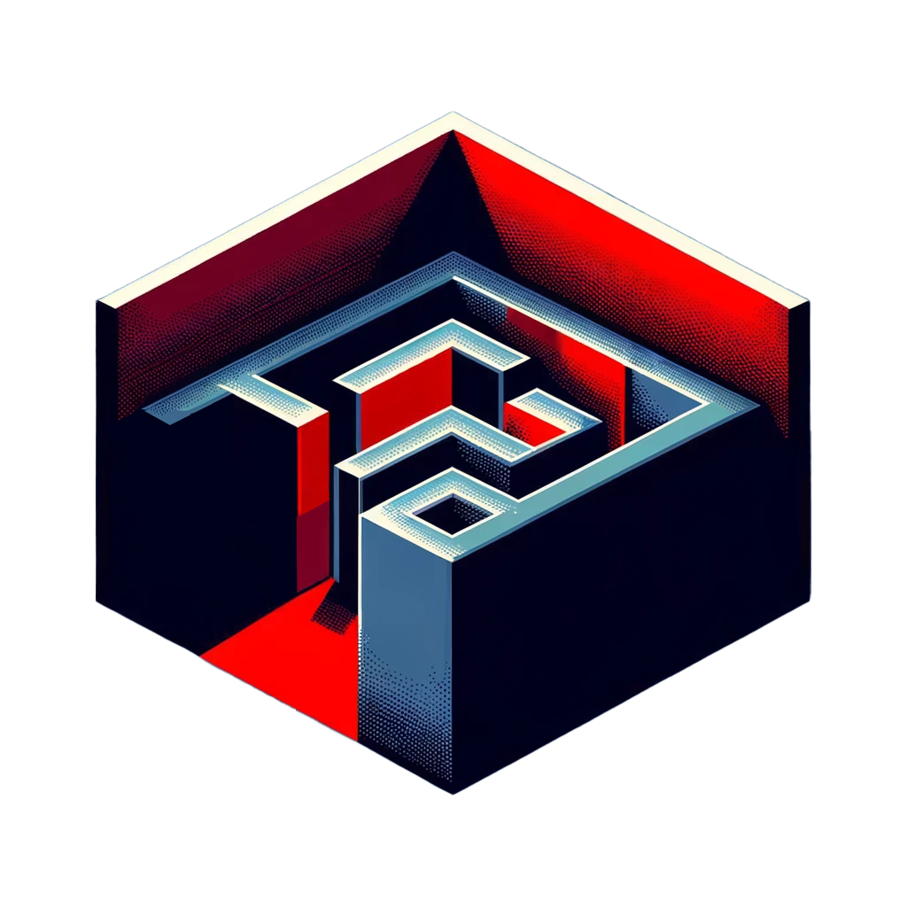
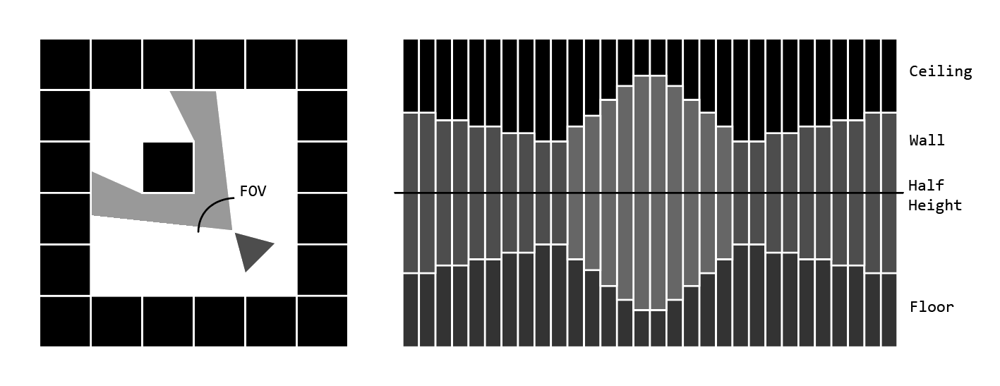
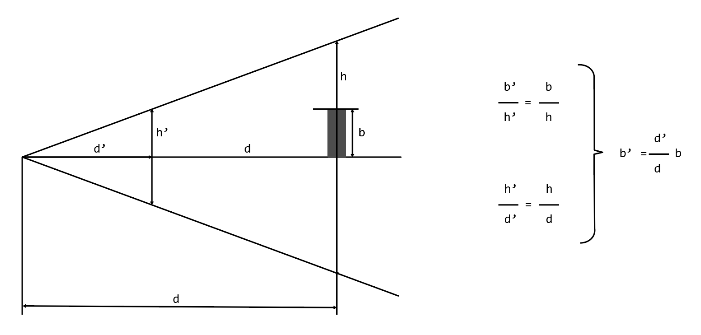
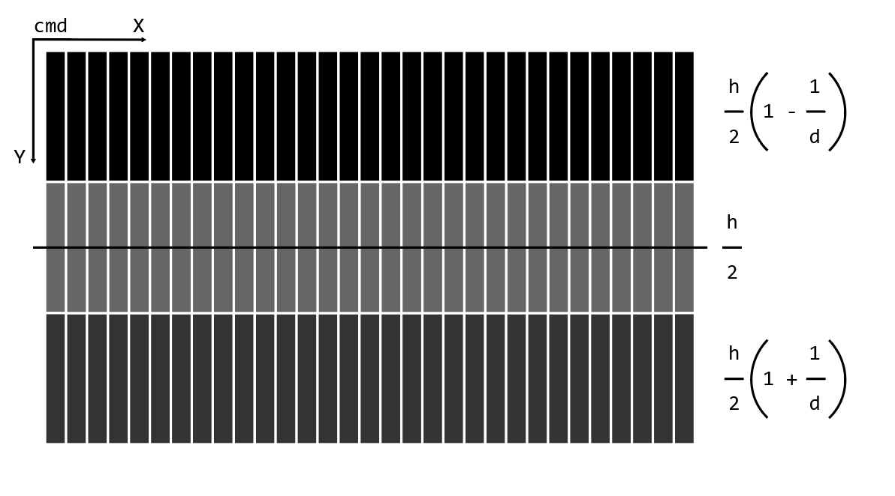
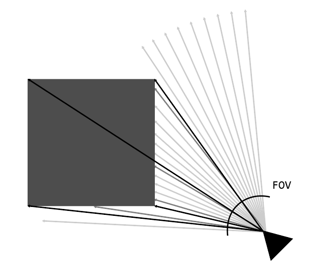

# RayCasting Engine
---

## Introduction
**[RayCasting](https://en.wikipedia.org/wiki/Ray_casting)** - technique in computer graphics that allows you to create 3D projections based on a 2D plane. This technique was particularly valued in an era when the processing power of computers was limited. It allowed games, the first of which was [Wolfenstein 3D](https://en.wikipedia.org/wiki/Wolfenstein_3D), to achieve an impressive illusion of three-dimensionality.


## Programming language
The C programming language, known for its high performance and ability for low-level resource management, was chosen to realize the project. Graphics are displayed using the [ncurses](https://en.wikipedia.org/wiki/Ncurses#:~:text=ncurses%20(new%20curses)%20is%20a,in%20a%20terminal%2Dindependent%20manner.) library, which allows efficient drawing in the console, creating complex text interfaces and visualizations. The Windows API is used to read keystrokes, providing reliable and responsive user interaction with the program. These technologies provide a strong set of tools for creating raycasting-based games. The project is compatible with Windows OC only.

## How to run the project
1. To get started, you'll need to install the ncurses library, as it is not included by default
2. Then unpack and open the project in the console line
3. To compile:
```
gcc -o main main.c -lpdcurses
```
4. To run:
```
main
```
And that's it!

## Control
To make the player move, we'll set up a way to watch for key presses on the keyboard using the Windows API. We're going to look for when someone presses the 'W', 'S', 'A', and 'D' keys to move the player.

```c
void checkKeyState()
{
	...
}
```

Now let's look at the logic of the movement. Check the labels to see what each key will do.

* `W (up)` -	walk forwards
* `S (down)` - walk backward
* `A (left)`	- turn left
* `D (right)` - turn right
* `Esc` - exit

In the code fragment below, we check whether the user is currently pressing the 'A' key to perform a left turn. For this purpose, the `GetAsyncKeyState` function is used, which checks the state of the specified key.
```c
if (GetAsyncKeyState((unsigned short)'A') & 0x8000)
{
	playerDir += (playerSpeed * 0.75f) * frameTime;
}
```
After the program recognizes that the 'A' key has been pressed (or 'D' for turn right), we simple increment or decrement the angle of the player with the player speed. 

For the up and down logic, we need to get the `sin` and `cos` of the player angle to discover the player direction and what we need to increment for the player coordinates to move the player. In the code fragment below, we check whether the user is currently pressing the 'W' key to walk forward.
```c
if (GetAsyncKeyState((unsigned short)'W') & 0x8000)
{
	playerX += sinf(playerDir) * playerSpeed * frameTime;
	playerY += cosf(playerDir) * playerSpeed * frameTime;

	if (map[(int)playerY][(int)playerX] == '#')
	{
		playerX -= sinf(playerDir) * playerSpeed * frameTime;
		playerY -= cosf(playerDir) * playerSpeed * frameTime;
	}			
}
```
As you can see, we also check for a collision as we move, and if there is one, we stand in the same place.

Similarly, we check for pressing the `Esc` key to exit the program at the right moment and clear the console window.
```c
if (GetAsyncKeyState(VK_ESCAPE) & 0x8000)
{
	system("cls");
	exit(1);
}
```
## Logic

RayCasting transforms a two-dimensional map, which is represented as an array of characters, into a three-dimensional projection on the screen. Our character array is a matrix with values `#` for wall and `.` for empty space.

```c
char map[mapHeight][mapWidth] = {
    {"################"},
    {"#..#...........#"},
    {"#..#....########"},
    {"#..#...........#"},
    {"#..#...#.......#"},
    {"#......#.......#"},
    {"#..............#"},
    {"###............#"},
    {"#..............#"},
    {"#......####..###"},
    {"#......#.......#"},
    {"#......#.......#"},
    {"#..............#"},
    {"#.....########.#"},
    {"#..............#"},
    {"################"}
};
```

The logic behind RayCasting is to throw rays in the direction of the player's view. This is necessary to find walls on the map and check the distance to them in order to calculate the height of the lines from which the objects are drawn. 



The direction of the ray `rayDir` for drawing a particular stripe on the screen is based on the fact that during the entire pass along the axis X of the screen it is necessary to completely pass the angle of player's field of view `FOV`.

```c
void renderFrame()
{
    	for (int x = 0; x < screenWidth; x++)
    	{
        	float rayDir = (playerDir + playerFOV / 2.0f) - ((float)x / (float)screenWidth) * playerFOV;
        	float wallDistance = 0.0f;
	
        	float rayX = sinf(rayDir);                                                                              
        	float rayY = cosf(rayDir);

		...
    	}
}
```

We will search for the distance to the wall iteratively: at the beginning we have a direction in which we want to check for the existence of an object, then we cyclically, in small steps `wallDistance += 0.1f` go in this direction. In the end, either the ray has collided with an object `hitWallFlag`, or it has gone beyond the radius of visibility `playersMaxDepth`.

```c
int hitWallFlag = 0;                                                                                    
int hitEdgeFlag = 0;   
 
while (!hitWallFlag && wallDistance < playersMaxDepth)                                                  
{
	wallDistance += 0.1f;                                                                               
 
	int distanceX = (int)(playerX + rayX * wallDistance);                                              
	int distanceY = (int)(playerY + rayY * wallDistance);                                             
 
	if (distanceX < 0 || distanceX >= mapWidth || distanceY < 0 || distanceY >= mapHeight)              
	{ 
		hitWallFlag = 1;                                                                                
		wallDistance = playersMaxDepth;
	}
	else if ( map[distanceY][distanceX] == '#')                                                         
	{ 
		hitWallFlag = 1;

		...
	}

	for (int y = 0; y < screenHeight; y++)
	{

		...
	}
}
```
Well, now we have everything we need to create the illusion of a third dimension!

## Rendering

Having the distance `d` to the object in the required direction, we can calculate its height `b'` relative to the screen. So, we need to understand how the height of objects changes when the distance to them changes.



To draw the stripe, we need to set two Y axis coordinates: the first one is the point where the wall starts and the ceiling ends, and the second one is where the wall ends and the floor starts. Let's make these two points symmetrical about the center in height by setting them as is below.



It can be seen that if the distance to the wall becomes bigger, these points go to the center and the height of the stripe becomes smaller, so the sky and the floor cover almost all the space. And if the distance gets smaller, these points go to the borders and the stripe gets bigger. Let's take a look at how this is realized.

```c
int ceilingHeight = (float)(screenHeight/2.0) - screenHeight / ((float)wallDistance);                 
int floorHeight = (float)(screenHeight/2.0) + screenHeight / ((float)wallDistance);                    

for (int y = 0; y < screenHeight; y++)
{
	if (y < ceilingHeight)                                                                            
	{
		float d = 1.0f + ((float)y - screenHeight / 2.0) / ((float)screenHeight / 2.0);
		int gradientIndex = (int)(d * gradientSize);
		if (gradientIndex < 0) gradientIndex = 0;
		if (gradientIndex >= gradientSize) gradientIndex = gradientSize - 1;

		char ceilingShader = gradient2[gradientIndex];

		attron(COLOR_PAIR(2)); 
		mvprintw(y,x,"%c",ceilingShader);
		attroff(COLOR_PAIR(2));
	} 
	else if (y >= ceilingHeight && y <= floorHeight)                                                  
	{
		int gradientIndex = (int)((wallDistance / playersMaxDepth) * gradientSize);
		if (gradientIndex < 0) gradientIndex = 0;
		if (gradientIndex >= gradientSize) gradientIndex = gradientSize - 1;

		char wallShader = gradient1[gradientIndex];
		if (hitEdgeFlag) wallShader = ' ';

		attron(COLOR_PAIR(1));
		mvprintw(y,x,"%c",wallShader);
		attroff(COLOR_PAIR(1));
	} 
	else                                                                                           
	{
		float d = 1.0f - ((float)y - screenHeight / 2.0) / ((float)screenHeight / 2.0);
		int gradientIndex = (int)(d * gradientSize);
		if (gradientIndex < 0) gradientIndex = 0;
		if (gradientIndex >= gradientSize) gradientIndex = gradientSize - 1;

		char floorShader = gradient2[gradientIndex];
                
		attron(COLOR_PAIR(3));
		mvprintw(y,x,"%c",floorShader);
		attroff(COLOR_PAIR(3));
	} 
}
```

Here we calculate the brightness level of the character that will be displayed in each specific cell of the console based on the distance to the object. The characters themselves are taken from arrays, where gradients from the brightest to the darkest are already given.

```c
#define gradientSize 10        
char gradient1[gradientSize]="@%#+=*:-. ";  
char gradient2[gradientSize]="&Oi?+~>:. ";   
```

And the colors were initialized in the `main` function using the `init_pair` function.

```c
start_color();                            
init_pair(1, COLOR_RED, COLOR_BLACK);       
init_pair(2, COLOR_BLUE, COLOR_BLACK);      
init_pair(3, COLOR_BLACK + 8, COLOR_BLACK); 
```

## Edge rendering

Now let's look at the display of wall edges. If we have determined that there has been a collision with a wall, we can immediately determine its location and the location of its four edges.
So we have four vectors that point from the viewer exactly into the edges of the wall. If the angle between the emitted ray and one of these vectors becomes small, we will take this part of the wall as an edge and not draw it.



The minimum angle between vectors is achieved when their scalar product is maximized. We will look for the scalar product between the direction vector and the vectors leading into the edges of the wall.

```c
float edgeDistance[4]; 
float dotProduct[4];

for (int i = 0; i < 4; i++)
{
	int edgeX = i % 2;
	int edgeY = i / 2;

	float vectorX = (float)distanceX + edgeX - playerX;
	float vectorY = (float)distanceY + edgeY - playerY;

	edgeDistance[i] = sqrtf(vectorX * vectorX + vectorY * vectorY);
	dotProduct[i] = (rayX * vectorX / edgeDistance[i]) + (rayY * vectorY / edgeDistance[i]);
}
                
for (int i = 0; i < 4; i++)
{
	for (int j = i + 1; j < 4; j++) 
	{
		if (edgeDistance[j] < edgeDistance[i]) 
		{
			float temp = edgeDistance[j];
			edgeDistance[j] = edgeDistance[i];
			edgeDistance[i] = temp;

			temp = dotProduct[j];
			dotProduct[j] = dotProduct[i];
			dotProduct[i] = temp;
		}
	}
}

float proximity = 0.004f;

for (int i = 0; i < 2; i++)
{
	if (acosf(dotProduct[i]) < proximity) 
	{
		hitEdgeFlag = 1;
		break;
	}
}
```

Now we can see the edges of the walls.

## Game cykle 

The projection should be redrawn at each iteration of the rendering. That's why our game loop will consist of an infinitely running `while(1)`, which every iteration will calculate the time change per frame, check for keyboard presses, render a new frame based on the new changes, overlay the useful information and statistics on top of it, and display it all on the screen from the buffer. Here's what the realization of this looks like in code.

```c
while(1)  
{
        timeAfter = clock();                                           
        frameTime = (float)(timeAfter - timeBefore) / CLOCKS_PER_SEC;  
        timeBefore = timeAfter;                                        
        
        map[(int)playerY][(int)playerX] = '.';                       

        checkKeyState();                                              

        map[(int)playerY][(int)playerX] = 'o';                       

        renderFrame();                                                

        displayStats();                                                

        refresh();                                                     
}
```

That's all, thank you for your attention!

## Sources and inspirations
1. [CommandLineFPS](https://github.com/OneLoneCoder/CommandLineFPS)
2. [RayCastingTutorial](https://github.com/vinibiavatti1/RayCastingTutorial)
3. [OpenGL-Raycaster_v1](https://github.com/3DSage/OpenGL-Raycaster_v1?tab=readme-ov-file)
4. [Raycasting game engine with ASCII display](https://www.youtube.com/watch?v=94YOd0gimF8)
