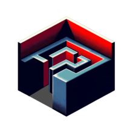

# RayCasting Engine
---

## Introduction
**[RayCasting](https://en.wikipedia.org/wiki/Ray_casting)** - technique in computer graphics that allows you to create 3D projections based on a 2D plane. This technique was particularly valued in an era when the processing power of computers was limited. It allowed games, the first of which was [Wolfenstein 3D](https://en.wikipedia.org/wiki/Wolfenstein_3D), to achieve an impressive illusion of three-dimensionality.


## Programming language
The C programming language, known for its high performance and ability for low-level resource management, was chosen to realize the project. Graphics are displayed using the [ncurses](https://en.wikipedia.org/wiki/Ncurses#:~:text=ncurses%20(new%20curses)%20is%20a,in%20a%20terminal%2Dindependent%20manner.) library, which allows efficient drawing in the console, creating complex text interfaces and visualizations. The Windows API is used to read keystrokes, providing reliable and responsive user interaction with the program. These technologies provide a strong set of tools for creating raycasting-based games. The project is compatible with Windows OC only.

## How to run the project
1. To get started, you'll need to install the ncurses library, as it is not included by default
2. Then unpack and open the project in the console line
3. To compile:
```
gcc -o main main.c –lpdcurses
```
4. To run:
```
main
```
And that's it!

## Control
To make the player move, we'll set up a way to watch for key presses on the keyboard using the Windows API. We're going to look for when someone presses the 'W', 'S', 'A', and 'D' keys to move the player.

Now let's look at the logic of the movement. Check the labels to see what each key will do.

* `W (up)` -	walk forwards
* `S (down)` - walk backward
* `A (left)`	- turn left
* `D (right)` - turn right
* `Esc` - Exit

In the code fragment below, we check whether the user is currently pressing the 'A' key to perform a left turn. For this purpose, the `GetAsyncKeyState` function is used, which checks the state of the specified key.
```c
if (GetAsyncKeyState((unsigned short)'A') & 0x8000)
    {
        playerDir += (playerSpeed * 0.75f) * frameTime;
    }
```
After the program recognizes that the 'A' key has been pressed (or 'D' for turn right), we simple increment or decrement the angle of the player with the player speed. 

For the up and down logic, we need to get the `sin` and `cos` of the player angle to discover the player direction and what we need to increment for the player coordinates to move the player. In the code fragment below, we check whether the user is currently pressing the 'W' key to walk forward.
```c
if (GetAsyncKeyState((unsigned short)'W') & 0x8000)
    {
	    playerX += sinf(playerDir) * playerSpeed * frameTime;
	    playerY += cosf(playerDir) * playerSpeed * frameTime;

	    if (map[(int)playerY][(int)playerX] == '#')
	    {
		    playerX -= sinf(playerDir) * playerSpeed * frameTime;
		    playerY -= cosf(playerDir) * playerSpeed * frameTime;
	    }			
    }
```
As you can see, we also check for a collision as we move, and if there is one, we stand in the same place.

Similarly, we check for pressing the `Esc` key to exit the program at the right moment and clear the console window.
```c
if (GetAsyncKeyState(VK_ESCAPE) & 0x8000)
    {
        system("cls");
        exit(1);
    }
```
